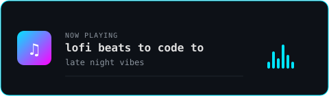

<!-- ═══════════════════════════════════════════════════════════════════════ -->
<!--               al3x-X-y  ·  cyberpunk profile  ·  v2.0               -->
<!-- ═══════════════════════════════════════════════════════════════════════ -->

<div align="center">
  
</div>

<!-- ─── DIVIDER ───────────────────────────────────────────────────────── -->
<div align="center">
  
</div>

<!-- ─── TYPING ANIMATION ─────────────────────────────────────────────── -->
<div align="center">

[](https://git.io/typing-svg)

</div>

<br>

<!-- ─── BADGES ────────────────────────────────────────────────────────── -->
<div align="center">

  <a href="https://wakatime.com/@33f67ced-9997-4f06-b228-ad7141d0071e">
    
  </a>
  &nbsp;
  
  &nbsp;
  

</div>

<br>

<!-- ─── DIVIDER ───────────────────────────────────────────────────────── -->
<div align="center">
  
</div>

<br>

<!-- ─── ABOUT ME ──────────────────────────────────────────────────────── -->

<div align="center">

```js
// ┌──────────────────────────────────────────────────────┐
// │  $ cat ~/al3x/.profile                               │
// └──────────────────────────────────────────────────────┘

const mass = {
    name:         "al3x-X-y",
    title:        "Systems Thinker & Linux Nerd",
    location:     "somewhere on the interwebs",

    learning:     ["C++", "Data Structures & Algorithms"],
    askMeAbout:   ["C", "Linux", "Window Managers", "Ricing"],
    contact:      "alexd2d.01@gmail.com",

    environment: {
        os:       "Linux  ─  tiling WM enthusiast",
        editor:   "Neovim / VS Code",
        shell:    "zsh + starship prompt",
        theme:    "catppuccin mocha 🐈‍⬛"
    },

    status:       "compiling life one commit at a time..."
};
```

</div>

<br>

<!-- ─── DIVIDER ───────────────────────────────────────────────────────── -->
<div align="center">
  
</div>

<br>

<!-- ─── TECH STACK ────────────────────────────────────────────────────── -->

<div align="center">
  
</div>

<br>

<div align="center">

<!-- Row 1: Languages & Core -->
<a href="#"></a>

<br><br>

<!-- Row 2: Tools & Platforms -->
<a href="#"></a>

<br><br>

<!-- Row 3: Editors & Workflow -->
<a href="#"></a>

</div>

<br>

<!-- ─── DIVIDER ───────────────────────────────────────────────────────── -->
<div align="center">
  
</div>

<br>

<!-- ─── COMPETITIVE PROGRAMMING ──────────────────────────────────────── -->

<div align="center">

  <a href="https://codeforces.com/profile/al3x_X_y">
    
  </a>

</div>

<br>

<!-- ─── DIVIDER ───────────────────────────────────────────────────────── -->
<div align="center">
  
</div>

<br>

<!-- ─── GITHUB STATS ─────────────────────────────────────────────────── -->

<div align="center">
  
  <h3>
    
  </h3>

</div>

<br>

<div align="center">

  
  &nbsp;
  

</div>

<br>

<div align="center">

  

</div>

<br>

<div align="center">

  

</div>

<br>

<!-- ─── DIVIDER ───────────────────────────────────────────────────────── -->
<div align="center">
  
</div>

<br>

<!-- ─── CONTRIBUTION SNAKE ───────────────────────────────────────────── -->

<div align="center">

  <h3>
    
  </h3>

</div>

<br>

<div align="center">
  <picture>
    <source media="(prefers-color-scheme: dark)" srcset="https://raw.githubusercontent.com/al3x-X-y/al3x-X-y/output/github-snake-dark.svg" />
    <source media="(prefers-color-scheme: light)" srcset="https://raw.githubusercontent.com/al3x-X-y/al3x-X-y/output/github-snake.svg" />
    
  </picture>
</div>

<br>

<!-- ─── DIVIDER ───────────────────────────────────────────────────────── -->
<div align="center">
  
</div>

<br>

<!-- ─── NOW PLAYING ──────────────────────────────────────────────────── -->

<div align="center">

  <h3>
    
  </h3>

</div>

<br>

<div align="center">
  
</div>

<br>

<!-- ─── DIVIDER ───────────────────────────────────────────────────────── -->
<div align="center">
  
</div>

<br>

<!-- ─── CONNECT ───────────────────────────────────────────────────────── -->

<div align="center">

  <h3>
    
  </h3>

</div>

<br>

<div align="center">
  
  <a href="mailto:alexd2d.01@gmail.com">
    
  </a>
  &nbsp;
  <a href="https://www.linkedin.com/in/al3x-x-y/" target="_blank">
    
  </a>
  &nbsp;
  <a href="https://twitter.com/" target="_blank">
    
  </a>
  &nbsp;
  <a href="https://www.youtube.com/" target="_blank">
    
  </a>
  &nbsp;
  <a href="https://codeforces.com/profile/al3x_X_y" target="_blank">
    
  </a>

</div>

<br><br>

<!-- ─── FOOTER ────────────────────────────────────────────────────────── -->

<div align="center">
  
</div>

<!-- ═══════════════════════════════════════════════════════════════════════ -->
